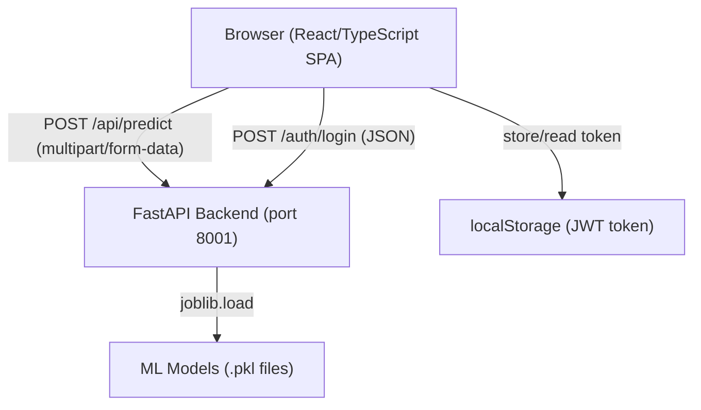

# Design Document: Project Analysis & Debug

## Overview

This document describes the technical design for auditing, debugging, and improving the Predictive Maintenance System — a FastAPI + React/TypeScript application that uses two Random Forest classifiers to predict equipment failure likelihood and failure reason from industrial sensor data.

Seven confirmed bugs have been identified through code analysis. This design covers the fix strategy for each bug, the new files to be added, and the property-based testing approach to verify correctness invariants hold across arbitrary inputs.

The system processes CSV files containing five sensor readings per row (air temperature, process temperature, rotational speed, torque, tool wear), runs them through a preprocessing pipeline and two ML models, and returns structured predictions with risk levels and maintenance recommendations.

---

## Architecture

The system is a two-tier web application:



**Request flow for prediction:**
1. User uploads CSV via `FileUpload.tsx` dropzone
2. Frontend POSTs to `/api/predict` with `multipart/form-data`
3. `validation_service.py` validates file type and CSV structure
4. `preprocessing_service.py` extracts the 5-column feature array
5. `ml_service.py` runs failure model → reason model (failures only) → assembles results
6. Frontend renders paginated results in `AnalysisResults.tsx`

**Request flow for authentication (post-fix):**
1. User submits credentials on `LoginPage.tsx`
2. Frontend POSTs to `/auth/login` with JSON body
3. Backend validates credentials against environment variables
4. Backend returns a signed JWT (python-jose, HS256)
5. Frontend stores JWT in `localStorage`; `jwtDecode` reads it on every page load

---

## Components and Interfaces

### Backend Components

#### `app/routes/auth.py` (new)

New router providing the `POST /auth/login` endpoint.

```python
# LoginRequest: { username: str, password: str }
# LoginResponse: { access_token: str, token_type: "bearer" }
POST /auth/login
  Body: LoginRequest
  Returns: LoginResponse (200) | ErrorResponse (401)
```

Reads `AUTH_USERNAME` and `AUTH_PASSWORD` from environment variables (defaults: `"admin"` / `"predictive2024"` for dev). Issues a signed JWT with claims `sub`, `email`, `exp` (24h), `iat` using `python-jose` with HS256 and a `JWT_SECRET_KEY` env var (default: a dev-only fallback string).

#### `app/schemas/auth_schema.py` (new)

```python
class LoginRequest(BaseModel):
    username: str
    password: str

class LoginResponse(BaseModel):
    access_token: str
    token_type: Literal["bearer"]
```

#### `app/config.py` (modified)

- Change `cors_origins` default from `["*"]` to `["http://localhost:3000"]`
- Add `jwt_secret_key: str` setting (reads `JWT_SECRET_KEY` env var)
- Add `auth_username: str` (reads `AUTH_USERNAME`, default `"admin"`)
- Add `auth_password: str` (reads `AUTH_PASSWORD`, default `"predictive2024"`)

#### `app/services/ml_service.py` (modified — Bug 2)

In `predict_failures`, the reason model must only be called on rows where `will_fail=True`:

```python
# Collect indices where will_fail is True
failure_indices = [i for i, p in enumerate(failure_probabilities) if p >= 0.5]

# Call reason_model only on failure rows
if failure_indices:
    failure_features = features[failure_indices]
    reason_predictions = reason_model.predict(failure_features)
    reason_map = dict(zip(failure_indices, reason_predictions))
else:
    reason_map = {}

# For each row: look up reason_map[idx] if idx in failure_indices, else None
```

#### `app/main.py` (modified)

Register the new auth router:
```python
from app.routes.auth import router as auth_router
app.include_router(auth_router, tags=["auth"])
```

#### `train_models.py` (modified — Bug 6)

Replace hardcoded `CSV_FILE_PATH` with `argparse` + env var fallback:

```python
import argparse, os, sys

parser = argparse.ArgumentParser()
parser.add_argument("--data-path", default=os.environ.get("DATA_PATH"))
args = parser.parse_args()

if not args.data_path or not os.path.exists(args.data_path):
    print(f"Error: dataset file not found: {args.data_path}")
    sys.exit(1)

CSV_FILE_PATH = args.data_path
```

### Frontend Components

#### `frontend/src/contexts/AuthContext.tsx` (modified — Bugs 1 & 5)

Replace the `btoa`-based mock token and hardcoded credentials with a real backend call:

```typescript
const login = async (username: string, password: string) => {
  const response = await axios.post('/auth/login', { username, password })
  const { access_token } = response.data
  localStorage.setItem('token', access_token)
  const decoded: any = jwtDecode(access_token)
  setToken(access_token)
  setUser({ username: decoded.sub, email: decoded.email })
}
```

The `useEffect` on mount already calls `jwtDecode` — this will now work correctly because the stored token is a real 3-segment JWT.

#### `frontend/src/components/FileUpload.tsx` (modified — Bug 3)

Remove Excel MIME types from the dropzone `accept` config and update UI text:

```typescript
accept: {
  'text/csv': ['.csv'],
},
// UI text: "Supported formats: CSV only"
// onDrop validation: remove .xlsx check
```

#### `frontend/src/components/AnalysisResults.tsx` (modified — Bug 7)

Replace `.slice(0, 10)` with pagination state:

```typescript
const [currentPage, setCurrentPage] = useState(1)
const PAGE_SIZE = 50

const paginatedPredictions = data.predictions.slice(
  (currentPage - 1) * PAGE_SIZE,
  currentPage * PAGE_SIZE
)
const totalPages = Math.ceil(data.predictions.length / PAGE_SIZE)
```

Add Previous/Next buttons and a page indicator below the table.

---

## Data Models

### Backend Pydantic Models

**Existing (unchanged):**
```python
class PredictionResult(BaseModel):
    row: int
    will_fail: bool
    failure_probability: float
    risk_level: str
    failure_reason: str | None
    recommendation: str

class PredictionResponse(BaseModel):
    status: Literal["success"]
    total_records: int
    predictions: list[PredictionResult]

class HealthResponse(BaseModel):
    status: str
    model_loaded: bool
    app_name: str
    version: str
```

**New:**
```python
class LoginRequest(BaseModel):
    username: str
    password: str

class LoginResponse(BaseModel):
    access_token: str
    token_type: Literal["bearer"]
```

### Frontend TypeScript Interfaces

**Existing (unchanged — already correct):**
```typescript
interface PredictionResult {
  row: number
  will_fail: boolean
  failure_probability: number
  risk_level: string
  failure_reason: string | null
  recommendation: string
}

interface PredictionResponse {
  status: string
  total_records: number
  predictions: PredictionResult[]
}
```

**New:**
```typescript
interface LoginRequest {
  username: string
  password: string
}

interface LoginResponse {
  access_token: string
  token_type: string
}
```

### JWT Payload Structure

```json
{
  "sub": "admin",
  "email": "admin@predictive-maintenance.com",
  "exp": 1234567890,
  "iat": 1234567890
}
```

### Environment Variables

| Variable | Default (dev) | Description |
|---|---|---|
| `CORS_ORIGINS` | `["http://localhost:3000"]` | Allowed CORS origins |
| `JWT_SECRET_KEY` | `"dev-secret-key-change-in-prod"` | HS256 signing key |
| `AUTH_USERNAME` | `"admin"` | Valid login username |
| `AUTH_PASSWORD` | `"predictive2024"` | Valid login password |
| `DATA_PATH` | _(none)_ | Dataset path for train_models.py |

---

## Correctness Properties

*A property is a characteristic or behavior that should hold true across all valid executions of a system — essentially, a formal statement about what the system should do. Properties serve as the bridge between human-readable specifications and machine-verifiable correctness guarantees.*

### Property 1: Output count equals input row count

*For any* numpy feature array of shape `(n, 5)` with `n >= 1` and finite float64 values, `predict_failures` SHALL return exactly `n` `PredictionResult` objects.

**Validates: Requirements 1.8, 1.9, 10.1**

---

### Property 2: All failure probabilities are in [0.0, 1.0]

*For any* numpy feature array of shape `(n, 5)` with finite float64 values, every `failure_probability` in the returned predictions SHALL be in the closed interval `[0.0, 1.0]`.

**Validates: Requirements 2.1, 10.2**

---

### Property 3: All risk levels are in the valid set

*For any* numpy feature array of shape `(n, 5)` with finite float64 values, every `risk_level` in the returned predictions SHALL be exactly one of `{"High Risk", "Medium Risk", "Low Risk"}`.

**Validates: Requirements 2.2, 10.3**

---

### Property 4: Risk level thresholds are correct

*For any* probability value `p` in `[0.0, 1.0]`, `calculate_risk_level(p)` SHALL return `"High Risk"` if `p >= 0.8`, `"Medium Risk"` if `0.5 <= p < 0.8`, and `"Low Risk"` if `p < 0.5`.

**Validates: Requirements 2.3, 2.4, 2.5, 10.6**

---

### Property 5: failure_reason is null if and only if will_fail is false

*For any* numpy feature array of shape `(n, 5)` with finite float64 values, for every row in the returned predictions: `failure_reason` SHALL be `None` when `will_fail` is `False`, and SHALL be a non-null string from the five defined failure types when `will_fail` is `True`.

**Validates: Requirements 2.6, 2.7**

---

### Property 6: will_fail is determined by the 0.5 threshold

*For any* numpy feature array of shape `(n, 5)` with finite float64 values, for every row in the returned predictions: `will_fail` SHALL equal `True` if and only if `failure_probability >= 0.5`.

**Validates: Requirements 2.8, 10.6**

---

### Property 7: Recommendation chain is correct

*For any* probability value `p` in `[0.0, 1.0]`, calling `generate_recommendation(calculate_risk_level(p))` SHALL return a non-empty string that is exactly one of `{"Immediate maintenance required", "Schedule maintenance within 7 days", "Continue normal operations"}`, consistent with the risk level thresholds.

**Validates: Requirements 2.9, 2.10, 2.11, 2.12, 10.7**

---

### Property 8: Row values are sequential 1..n

*For any* numpy feature array of shape `(n, 5)` with finite float64 values, the `row` values in the returned predictions SHALL equal `[1, 2, ..., n]` in order.

**Validates: Requirements 10.4**

---

### Property 9: Preprocessor output shape and dtype

*For any* valid pandas DataFrame with `n` rows and all five required columns containing finite numeric values, `extract_features` SHALL return a numpy array of shape `(n, 5)` with dtype `float64`.

**Validates: Requirements 3.1, 3.2, 10.5**

---

### Property 10: Row order is preserved in preprocessing

*For any* valid pandas DataFrame with `n` rows, the row order in the output feature array SHALL match the row order in the input DataFrame (i.e., `output[i]` corresponds to `input.iloc[i]`).

**Validates: Requirements 3.6**

---

### Property 11: Pagination shows all records

*For any* prediction dataset with `n` records and page size `k`, the union of all pages SHALL contain exactly `n` records with no duplicates and no omissions.

**Validates: Requirements 7.1, 7.2**

---

## Error Handling

### Backend Error Handling

| Scenario | HTTP Status | Response Shape |
|---|---|---|
| Non-CSV file uploaded | 400 | `ErrorResponse` with `details` list |
| Missing required columns | 400 | `ErrorResponse` with `details` listing missing columns |
| Non-numeric data in column | 400 | `ErrorResponse` with `details` identifying column + rows |
| Empty CSV (header only) | 400 | `ErrorResponse` with "file is empty" message |
| Models not loaded | 500 | `ErrorResponse` with generic "Internal server error" (no stack trace) |
| Invalid login credentials | 401 | `ErrorResponse` with "Invalid credentials" message |
| Unexpected server error | 500 | `ErrorResponse` with generic message only — no internal details exposed |

The existing `predict.py` route already catches `HTTPException` and re-raises it, and catches unexpected exceptions with a generic 500. The new `auth.py` route follows the same pattern.

### Frontend Error Handling

- `AuthContext.tsx`: `login()` propagates the axios error; `LoginPage.tsx` catches it and displays `err.response?.data?.detail?.message || err.message`
- `FileUpload.tsx`: existing error display reads `err.response?.data?.detail?.message` — this already matches the backend `ErrorResponse` shape
- `AnalysisResults.tsx`: pagination state resets to page 1 when new data arrives (via `useEffect` on `data` prop)

### train_models.py Error Handling

```python
if not args.data_path:
    print("Error: no data path provided. Use --data-path or set DATA_PATH env var.")
    sys.exit(1)

if not os.path.exists(args.data_path):
    print(f"Error: dataset file not found: {args.data_path}")
    sys.exit(1)
```

---

## Testing Strategy

### Dual Testing Approach

Both unit tests and property-based tests are required. They are complementary:
- Unit tests verify specific examples, edge cases, and integration points
- Property tests verify universal invariants across many generated inputs

### Property-Based Testing

**Library:** `hypothesis` (already in `requirements.txt` at version 6.92.1)

**Location:** `tests/test_ml_pipeline_properties.py` and `tests/test_preprocessing_properties.py`

**Configuration:** Each property test runs a minimum of 100 iterations (Hypothesis default `max_examples=100`).

**Tag format:** Each test is annotated with a comment:
```python
# Feature: project-analysis-debug, Property N: <property_text>
```

#### `tests/test_ml_pipeline_properties.py`

Tests Properties 1–8 using Hypothesis `@given` with `st.arrays` (numpy strategy) to generate random `(n, 5)` float64 feature arrays with finite values.

```python
from hypothesis import given, settings
from hypothesis import strategies as st
import hypothesis.extra.numpy as npst
import numpy as np

# Feature: project-analysis-debug, Property 1: Output count equals input row count
@given(npst.arrays(dtype=np.float64, shape=npst.array_shapes(min_dims=2, max_dims=2, min_side=1, max_side=50),
                   elements=st.floats(min_value=-1e6, max_value=1e6, allow_nan=False, allow_infinity=False)))
@settings(max_examples=100)
def test_output_count_equals_input_row_count(features_raw):
    # reshape to (n, 5) ...
```

Each property maps directly to one test function. The loaded models are shared via a module-level fixture.

#### `tests/test_preprocessing_properties.py`

Tests Properties 9–10 using Hypothesis `@given` with `st.data()` to generate valid DataFrames.

```python
# Feature: project-analysis-debug, Property 9: Preprocessor output shape and dtype
@given(st.integers(min_value=1, max_value=200))
@settings(max_examples=100)
def test_preprocessor_output_shape_and_dtype(n_rows):
    df = make_valid_dataframe(n_rows)
    result = extract_features(df)
    assert result.shape == (n_rows, 5)
    assert result.dtype == np.float64
```

### Unit Tests

**Location:** `tests/test_ml_service.py`, `tests/test_validation_service.py`, `tests/test_preprocessing_service.py`, `tests/test_auth.py`

Unit tests cover:
- `calculate_risk_level` at exact threshold boundaries (0.5, 0.8)
- `generate_recommendation` for each of the three risk levels
- `validate_file_type` with `.csv`, `.CSV`, `.xlsx`, `.txt`
- `validate_csv_structure` with missing columns, non-numeric data, empty DataFrame
- `extract_features` with NaN values (edge case — raises `ValueError`)
- `POST /auth/login` with valid credentials (200), invalid credentials (401)
- `predict_failures` with a mix of failing and non-failing rows — verifies `failure_reason` is `None` for non-failures

### Running Tests

```bash
# Single run (no watch mode)
pytest tests/ -v

# Property tests only
pytest tests/test_ml_pipeline_properties.py tests/test_preprocessing_properties.py -v
```
