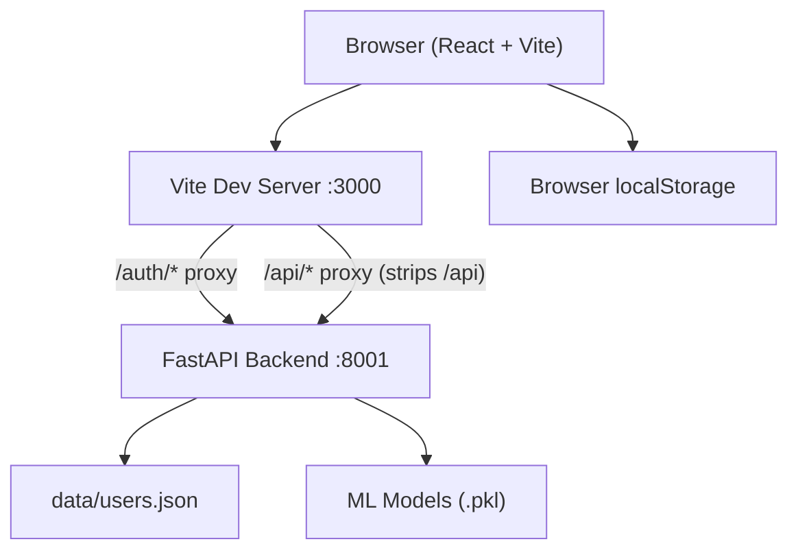
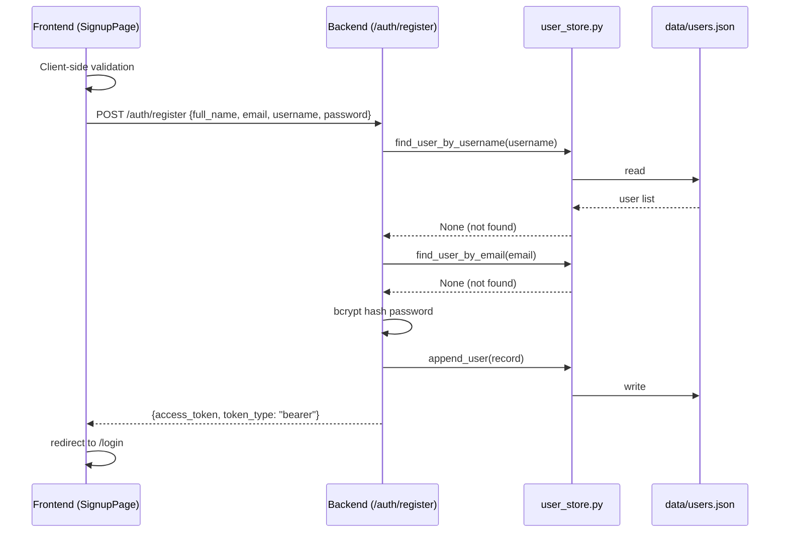
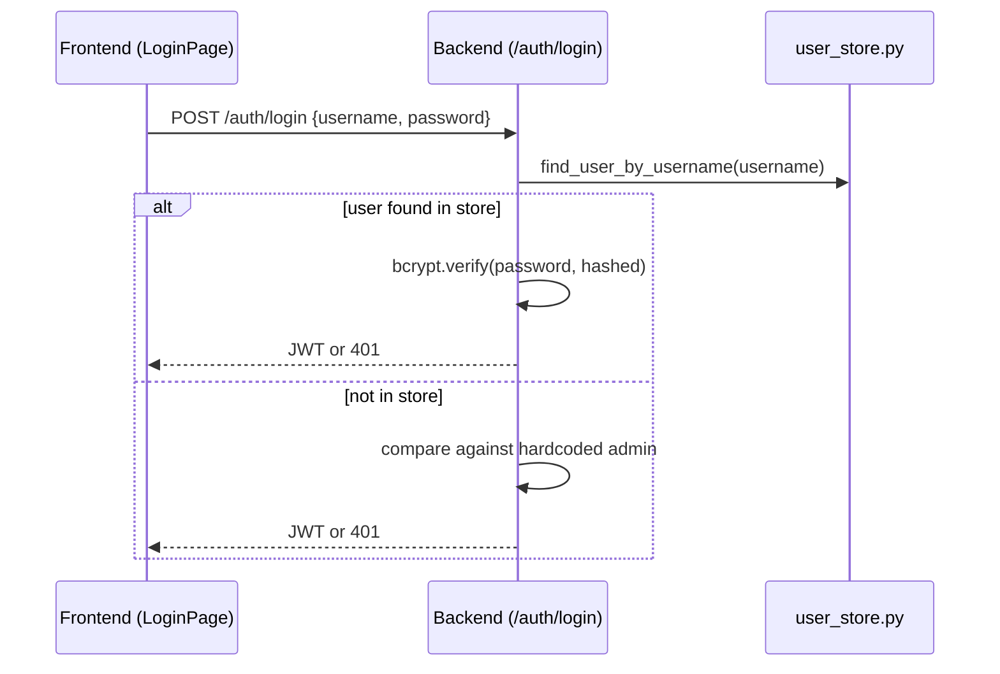
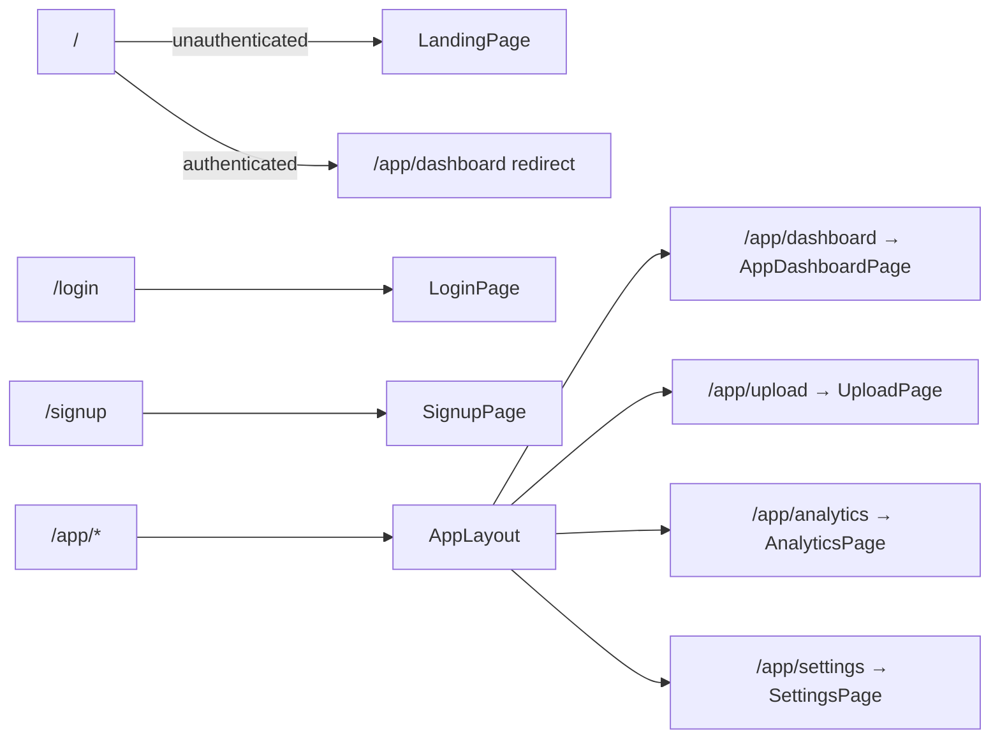

# Design Document: SaaS Upgrade — Predictive Maintenance

## Overview

This document describes the technical design for transforming the existing Predictive Maintenance application into a production-ready SaaS platform. The upgrade introduces multi-user registration, a public landing page, a sidebar navigation layout, dedicated pages for dashboard overview, data upload, analytics, and settings, and interactive metric cards with filtered table views — all while preserving the existing ML pipeline and authentication mechanism.

The existing system has a FastAPI backend (port 8001) with `/predict`, `/health`, and `/auth/login` endpoints, two trained Random Forest ML models (98.82% accuracy), JWT authentication with a single hardcoded user, and a React + TypeScript frontend with file upload and analysis results. The upgrade adds user registration, bcrypt password hashing, a JSON file-based user store, and a restructured frontend with new pages and layouts.

No external database is introduced. Analysis history is stored client-side in localStorage for the MVP. No new npm packages are required; all frontend dependencies (lucide-react, recharts, react-router-dom) are already present.

---

## Architecture

### System Overview



### Request Flow: Registration



### Request Flow: Login (extended)



### Frontend Route Structure



---

## Components and Interfaces

### Backend

#### `app/services/user_store.py`

```python
UserRecord = TypedDict('UserRecord', {
    'username': str,
    'email': str,
    'full_name': str,
    'hashed_password': str,
})

def load_users() -> list[UserRecord]: ...
def save_users(users: list[UserRecord]) -> None: ...
def find_user_by_username(username: str) -> UserRecord | None: ...
def find_user_by_email(email: str) -> UserRecord | None: ...
def append_user(user_record: UserRecord) -> None: ...
def init_user_store() -> None: ...  # creates data/ dir and empty file if missing
```

- Reads/writes `data/users.json` (relative to project root).
- `init_user_store()` is called from `app/main.py` lifespan startup.
- All file I/O is synchronous (acceptable for MVP JSON store).
- On corrupted JSON, raises a descriptive exception that the route handler catches and returns as HTTP 500.

#### `app/schemas/auth_schema.py` (additions)

```python
class RegisterRequest(BaseModel):
    full_name: str
    email: EmailStr
    username: str
    password: str = Field(min_length=8)

class RegisterResponse(BaseModel):
    access_token: str
    token_type: Literal["bearer"]

class ChangePasswordRequest(BaseModel):
    current_password: str
    new_password: str = Field(min_length=8)
```

`EmailStr` from `pydantic[email]` (already available via pydantic v2). The `min_length=8` constraint on `password` / `new_password` causes FastAPI to return HTTP 422 automatically for short passwords.

#### `app/routes/auth.py` (additions)

| Endpoint | Method | Auth | Description |
|---|---|---|---|
| `/auth/login` | POST | None | Extended: checks user store first, falls back to hardcoded admin |
| `/auth/register` | POST | None | Validates uniqueness, hashes password, saves user, returns JWT |
| `/auth/change-password` | POST | Bearer JWT | Verifies current password, updates hash in user store |

**`POST /auth/register` logic:**
1. Check `find_user_by_username` → 409 if found
2. Check `find_user_by_email` → 409 if found
3. `passlib.context.CryptContext(schemes=["bcrypt"]).hash(password)`
4. `append_user({username, email, full_name, hashed_password})`
5. Issue JWT with same payload shape as `/auth/login` (sub, email, exp, iat)
6. Return `RegisterResponse`

**`POST /auth/change-password` logic:**
1. Decode Bearer JWT from `Authorization` header → 401 if invalid/missing
2. `find_user_by_username(token.sub)` → 401 if not found (admin user cannot change password via this endpoint)
3. `CryptContext.verify(current_password, user.hashed_password)` → 401 if mismatch
4. Hash `new_password`, update record in user store via `save_users`
5. Return HTTP 200

**Extended `/auth/login` logic:**
1. `find_user_by_username(username)` — if found, verify bcrypt hash
2. If not found, compare against `settings.auth_username` / `settings.auth_password` (plaintext, existing behavior)
3. Issue JWT on success, 401 on failure

#### `app/main.py` (change)

Add `init_user_store()` call inside the `lifespan` startup block, before yielding.

#### `requirements.txt` (addition)

```
passlib[bcrypt]==1.7.4
python-jose[cryptography]==3.3.0
```

Note: `python-jose` is already used implicitly; adding it explicitly. `passlib[bcrypt]` is new.

---

### Frontend

#### New File Tree

```
frontend/src/
├── App.tsx                          (restructured routes)
├── contexts/
│   └── AuthContext.tsx              (add register, changePassword)
├── types/
│   └── index.ts                     (add AnalysisRecord)
├── layouts/
│   └── AppLayout.tsx                (new — Sidebar + <Outlet>)
├── components/
│   ├── Sidebar.tsx                  (new)
│   ├── ProtectedRoute.tsx           (unchanged)
│   ├── AnalysisResults.tsx          (modified — interactive filter cards)
│   ├── FileUpload.tsx               (unchanged)
│   └── Header.tsx                   (kept, not rendered in /app/* routes)
└── pages/
    ├── LandingPage.tsx              (new)
    ├── LoginPage.tsx                (unchanged)
    ├── SignupPage.tsx               (new)
    ├── AppDashboardPage.tsx         (new)
    ├── UploadPage.tsx               (renamed from DashboardPage.tsx)
    ├── AnalyticsPage.tsx            (new)
    └── SettingsPage.tsx             (new)
```

#### `App.tsx` Route Structure

```tsx
<AuthProvider>
  <BrowserRouter>
    <Routes>
      <Route path="/" element={<RootRedirect />} />
      <Route path="/login" element={<PublicRoute><LoginPage /></PublicRoute>} />
      <Route path="/signup" element={<PublicRoute><SignupPage /></PublicRoute>} />
      <Route path="/app" element={<ProtectedRoute><AppLayout /></ProtectedRoute>}>
        <Route index element={<Navigate to="/app/dashboard" replace />} />
        <Route path="dashboard" element={<AppDashboardPage />} />
        <Route path="upload" element={<UploadPage />} />
        <Route path="analytics" element={<AnalyticsPage />} />
        <Route path="settings" element={<SettingsPage />} />
      </Route>
    </Routes>
  </BrowserRouter>
</AuthProvider>
```

`RootRedirect`: renders `<Navigate to="/app/dashboard" />` if authenticated, else `<LandingPage />`.

`PublicRoute`: renders `<Navigate to="/app/dashboard" />` if authenticated, else renders children. Prevents authenticated users from seeing `/login` or `/signup`.

#### `AuthContext.tsx` additions

```typescript
interface AuthContextType {
  user: User | null
  token: string | null
  login: (username: string, password: string) => Promise<void>
  logout: () => void
  register: (fullName: string, email: string, username: string, password: string) => Promise<void>
  changePassword: (currentPassword: string, newPassword: string) => Promise<void>
  isAuthenticated: boolean
}
```

- `register`: POST `/auth/register`, on success redirects caller to `/login` (caller handles navigation).
- `changePassword`: POST `/auth/change-password` with `Authorization: Bearer <token>` header.

#### `types/index.ts` additions

```typescript
export interface AnalysisRecord {
  id: string           // crypto.randomUUID() or Date.now().toString()
  timestamp: string    // ISO 8601 — new Date().toISOString()
  totalRecords: number
  failureCount: number
  highRiskCount: number
}
```

localStorage key: `analyses_${username}` → `AnalysisRecord[]` (JSON serialized).

#### `AppLayout.tsx`

```tsx
export default function AppLayout() {
  return (
    <div className="flex h-screen overflow-hidden">
      <Sidebar />
      <main className="flex-1 overflow-y-auto bg-gray-50">
        <Outlet />
      </main>
    </div>
  )
}
```

#### `Sidebar.tsx`

Props: none (reads from `useAuth`, `useLocation`).

State:
- `isSidebarOpen: boolean` — controls mobile overlay visibility

Nav items (array, iterated):
```typescript
const navItems = [
  { label: 'Dashboard', path: '/app/dashboard', icon: LayoutDashboard },
  { label: 'Upload Data', path: '/app/upload', icon: Upload },
  { label: 'Analytics', path: '/app/analytics', icon: BarChart2 },
  { label: 'Settings', path: '/app/settings', icon: Settings },
]
```

Active item: `useLocation().pathname === item.path` → apply `ring-2` or `bg-primary-100` highlight class.

Mobile: hamburger `<button>` visible at `md:hidden`, overlay `<div>` with `onClick={closeSidebar}` covers main content when open.

#### `AnalysisResults.tsx` modifications

Add filter state:
```typescript
type FilterType = 'all' | 'failures' | 'high_risk' | 'healthy'
const [activeFilter, setActiveFilter] = useState<FilterType>('all')
```

Reset filter on new data:
```typescript
useEffect(() => { setActiveFilter('all') }, [data])
```

Derived filtered predictions:
```typescript
const filteredPredictions = useMemo(() => {
  switch (activeFilter) {
    case 'failures':   return data.predictions.filter(p => p.will_fail)
    case 'high_risk':  return data.predictions.filter(p => p.risk_level === 'High Risk')
    case 'healthy':    return data.predictions.filter(p => !p.will_fail)
    default:           return data.predictions
  }
}, [data, activeFilter])
```

Pagination applies to `filteredPredictions` (not `data.predictions`).

Each metric card becomes a `<button>` with `onClick` toggling the filter. Active card gets `ring-2 ring-offset-2 ring-{color}-500` class. Clicking the already-active card sets filter back to `'all'`.

#### `UploadPage.tsx`

Wraps existing `FileUpload` + `AnalysisResults` (moved from `DashboardPage.tsx`). On `handleAnalysisComplete`:

```typescript
const record: AnalysisRecord = {
  id: crypto.randomUUID(),
  timestamp: new Date().toISOString(),
  totalRecords: data.total_records,
  failureCount: data.predictions.filter(p => p.will_fail).length,
  highRiskCount: data.predictions.filter(p => p.risk_level === 'High Risk').length,
}
const key = `analyses_${user!.username}`
const existing: AnalysisRecord[] = JSON.parse(localStorage.getItem(key) ?? '[]')
localStorage.setItem(key, JSON.stringify([...existing, record]))
```

#### `AppDashboardPage.tsx`

Reads `analyses_${username}` from localStorage. Derives:
- Total analyses: `history.length`
- Most recent date: `history.at(-1)?.timestamp` formatted with `new Date(ts).toLocaleDateString()`
- Total failures: `history.reduce((sum, r) => sum + r.failureCount, 0)`
- Model accuracy: hardcoded `"98.82%"`
- Recent analyses: `history.slice(-5).reverse()`

Empty state: when `history.length === 0`, show message + "Run Your First Analysis" button → `navigate('/app/upload')`.

#### `AnalyticsPage.tsx`

Reads `analyses_${username}` from localStorage. Derives:
- Line chart data: `history.map(r => ({ date: new Date(r.timestamp).toLocaleDateString(), failures: r.failureCount }))`
- Pie chart data: aggregated `highRiskCount` vs derived medium/low (note: only `highRiskCount` is stored in `AnalysisRecord`; medium and low risk are not stored — the pie chart will show High Risk vs Non-High-Risk for MVP)
- Bar chart: not available from `AnalysisRecord` (failure reasons not stored) — display a placeholder or omit

Empty state: same pattern as `AppDashboardPage`.

#### `SettingsPage.tsx`

Displays `user.username` and `user.email` from `useAuth()` as read-only inputs.

Change password form state:
```typescript
const [currentPassword, setCurrentPassword] = useState('')
const [newPassword, setNewPassword] = useState('')
const [confirmPassword, setConfirmPassword] = useState('')
const [error, setError] = useState<string | null>(null)
const [success, setSuccess] = useState(false)
```

On submit: client-side validate (new password ≥ 8 chars, confirm matches), then call `changePassword(currentPassword, newPassword)` from `useAuth`. On success: set `success = true`, clear form fields. On 401: set `error` to backend message.

#### `LandingPage.tsx`

Sections:
1. Hero — headline, subheadline, "Get Started" → `/signup`, "Sign In" → `/login`
2. Features — 3+ feature cards (icons from lucide-react)
3. How It Works — 3-step numbered list
4. CTA footer — "Get Started" button

No auth state needed; uses `<Link>` from react-router-dom.

#### `SignupPage.tsx`

Form fields: full name, email, username, password, confirm password.

Validation (client-side, on submit):
- All fields required
- Email matches `/^[^\s@]+@[^\s@]+\.[^\s@]+$/`
- Password ≥ 8 characters
- Confirm password === password

On success response: navigate to `/login` with state `{ message: 'Account created. Please sign in.' }`. `LoginPage` reads this state and displays the message.

On 409: display backend error message inline, do not clear fields.

---

## Data Models

### Backend: User Record (JSON)

```json
{
  "username": "jdoe",
  "email": "jdoe@example.com",
  "full_name": "Jane Doe",
  "hashed_password": "$2b$12$..."
}
```

Stored as a JSON array in `data/users.json`:
```json
[
  { "username": "...", "email": "...", "full_name": "...", "hashed_password": "..." }
]
```

### Backend: JWT Payload

```json
{
  "sub": "jdoe",
  "email": "jdoe@example.com",
  "exp": 1700000000,
  "iat": 1699913600
}
```

Algorithm: HS256. Expiry: 24 hours. Secret: `settings.jwt_secret_key`.

### Frontend: AnalysisRecord

```typescript
interface AnalysisRecord {
  id: string           // crypto.randomUUID()
  timestamp: string    // ISO 8601
  totalRecords: number
  failureCount: number
  highRiskCount: number
}
```

localStorage key: `analyses_${username}` → JSON array of `AnalysisRecord`.

### Frontend: AuthContext User

```typescript
interface User {
  username: string
  email: string
}
```

Decoded from JWT on login/register/restore. Stored in React state only (not localStorage directly; token is stored and decoded on restore).

---

## Correctness Properties

*A property is a characteristic or behavior that should hold true across all valid executions of a system — essentially, a formal statement about what the system should do. Properties serve as the bridge between human-readable specifications and machine-verifiable correctness guarantees.*

### Property 1: Password length validation

*For any* password string with fewer than 8 characters, both the frontend validator and the backend `/auth/register` and `/auth/change-password` endpoints shall reject it — the frontend without submitting, the backend with HTTP 422.

**Validates: Requirements 2.5, 3.4, 9.4**

### Property 2: Password confirmation matching

*For any* pair of strings where the password and confirm-password values differ, the frontend validator shall reject the form submission and display an inline error, leaving the form fields unchanged.

**Validates: Requirements 2.6, 9.5**

### Property 3: User uniqueness enforcement

*For any* registration request where the username or email already exists in the User_Store, the `/auth/register` endpoint shall return HTTP 409 with a descriptive error message, and the User_Store shall remain unchanged.

**Validates: Requirements 3.2, 3.3**

### Property 4: Password hashing round-trip

*For any* plaintext password submitted to `/auth/register`, the value stored in `data/users.json` shall not equal the plaintext, and `passlib.CryptContext.verify(plaintext, stored_hash)` shall return `True`.

**Validates: Requirements 3.5, 10.2**

### Property 5: User persistence round-trip

*For any* valid registration request, after the request completes successfully, `find_user_by_username(username)` shall return a record with the submitted username, email, and full_name.

**Validates: Requirements 3.6**

### Property 6: Register-then-login round-trip

*For any* user registered via `/auth/register` with a given username and password, a subsequent POST to `/auth/login` with the same credentials shall return HTTP 200 with a valid JWT.

**Validates: Requirements 3.10**

### Property 7: Change-password round-trip

*For any* registered user, after a successful POST to `/auth/change-password` with a valid current password and a new password, a subsequent POST to `/auth/login` with the new password shall return HTTP 200 with a valid JWT, and login with the old password shall return HTTP 401.

**Validates: Requirements 9.10**

### Property 8: Incorrect current password rejected

*For any* registered user, a POST to `/auth/change-password` with an incorrect `current_password` shall return HTTP 401, and the user's stored password hash shall remain unchanged.

**Validates: Requirements 9.11**

### Property 9: Protected routes redirect unauthenticated users

*For any* route under `/app/*`, when no valid JWT is present in localStorage, the frontend shall redirect the user to `/login` rather than rendering the protected page.

**Validates: Requirements 4.1, 10.6**

### Property 10: Sidebar active highlight matches current route

*For any* authenticated route under `/app/*`, the Sidebar navigation item whose path matches the current `location.pathname` shall have the active highlight CSS class applied, and all other nav items shall not have that class.

**Validates: Requirements 4.3, 4.4**

### Property 11: Dashboard stats derived correctly from history

*For any* `AnalysisRecord[]` stored in localStorage for a given user, the Dashboard_Page shall display: total analyses count equal to `history.length`, total failures equal to `sum(r.failureCount)`, and the recent analyses list containing `min(history.length, 5)` records ordered most-recent-first.

**Validates: Requirements 5.1, 5.2, 5.3, 5.5**

### Property 12: localStorage scoped to authenticated username

*For any* two distinct usernames, the Analysis_History written under `analyses_${usernameA}` shall not be readable or modified by operations performed under `analyses_${usernameB}`.

**Validates: Requirements 5.8, 8.6**

### Property 13: Analysis record creation from prediction response

*For any* successful prediction response from `/predict`, the `AnalysisRecord` appended to localStorage shall have: `totalRecords === response.total_records`, `failureCount === predictions.filter(p => p.will_fail).length`, `highRiskCount === predictions.filter(p => p.risk_level === 'High Risk').length`, and `timestamp` parseable as a valid ISO 8601 date.

**Validates: Requirements 6.4, 6.5**

### Property 14: Filter card shows only matching rows

*For any* prediction response and any active filter value (`'failures'`, `'high_risk'`, `'healthy'`), every row displayed in the Detailed Predictions table shall satisfy the filter predicate, and the count of displayed rows shall equal the count of predictions satisfying that predicate.

**Validates: Requirements 7.1, 7.2, 7.3, 7.4**

### Property 15: Active filter state reflected in UI

*For any* active filter, the corresponding Metric_Card shall have the active highlight class applied, and the pagination label's total count shall equal the number of predictions satisfying the active filter predicate.

**Validates: Requirements 7.5, 7.6**

### Property 16: Filter toggle clears on re-click

*For any* active filter, clicking the same Metric_Card a second time shall set `activeFilter` to `'all'` and display all prediction rows.

**Validates: Requirements 7.7**

### Property 17: New analysis clears active filter

*For any* active filter state, when a new prediction response is loaded into `AnalysisResults`, `activeFilter` shall reset to `'all'`.

**Validates: Requirements 7.8**

### Property 18: Chart data derived from history

*For any* `AnalysisRecord[]` in localStorage, the line chart data points on the Analytics_Page shall have one entry per record with `failures === record.failureCount` and `date` derived from `record.timestamp`, and the total of all failure counts in the chart shall equal `sum(r.failureCount)`.

**Validates: Requirements 8.2, 8.3**

### Property 19: JWT consistency across auth endpoints

*For any* token issued by `/auth/register` or `/auth/change-password`, decoding it with the application's `jwt_secret_key` and algorithm `HS256` shall produce a payload with a valid `sub` (username) and `exp` set to approximately 24 hours from issuance.

**Validates: Requirements 3.7, 10.5**

---

## Error Handling

### Backend

| Scenario | HTTP Status | Response |
|---|---|---|
| Duplicate username on register | 409 | `{"detail": "Username already exists"}` |
| Duplicate email on register | 409 | `{"detail": "Email already registered"}` |
| Password < 8 chars (register/change-password) | 422 | Pydantic validation error |
| Invalid/missing JWT on change-password | 401 | `{"detail": "Not authenticated"}` |
| Incorrect current password on change-password | 401 | `{"detail": "Current password is incorrect"}` |
| Corrupted `data/users.json` | 500 | `{"detail": "User store unavailable"}` + logged |
| Invalid login credentials | 401 | `{"detail": {"status": "error", "message": "Invalid credentials"}}` (existing shape) |

The `init_user_store()` function handles missing `data/` directory and missing `data/users.json` gracefully at startup. It does not suppress JSON parse errors at runtime — those propagate as HTTP 500.

### Frontend

| Scenario | Behavior |
|---|---|
| Registration 409 | Inline error below form, fields preserved |
| Registration network error | Generic error message, fields preserved |
| Login 401 | Existing behavior (inline error) |
| Change password 401 | Inline error, form fields preserved |
| Change password success | Success banner, form cleared |
| localStorage parse error | Treat as empty history (graceful degradation) |
| JWT expired on restore | Token removed, user logged out (existing behavior) |

All API calls use `axios`. Error messages from the backend `detail` field are surfaced directly to the user where appropriate.

---

## Testing Strategy

### Dual Testing Approach

Both unit tests and property-based tests are required. They are complementary:
- Unit tests verify specific examples, integration points, and edge cases
- Property-based tests verify universal correctness across many generated inputs

### Backend Testing

**Framework:** pytest + hypothesis (already in `requirements.txt`)

**Property-based tests** (in `tests/test_auth_properties.py`):
- Each property test runs minimum 100 iterations (Hypothesis default)
- Tag format in comments: `Feature: saas-upgrade, Property N: <property_text>`

Properties to implement as Hypothesis tests:
- P1: `@given(st.text(max_size=7))` — short passwords rejected by register endpoint
- P3: `@given(user_record_strategy)` — duplicate username/email returns 409
- P4: `@given(st.text(min_size=8))` — hashed password verifies with plaintext
- P5: `@given(user_record_strategy)` — registered user findable in store
- P6: `@given(user_record_strategy)` — register then login succeeds
- P7: `@given(user_record_strategy, st.text(min_size=8))` — change password then login with new password
- P8: `@given(user_record_strategy, st.text())` — wrong current password returns 401

**Unit tests** (in `tests/test_auth.py`, extending existing):
- Example: valid registration returns 200 with JWT
- Example: admin hardcoded credentials still work
- Example: `init_user_store()` creates `data/` and `data/users.json` if missing
- Edge case: corrupted `data/users.json` returns 500
- Example: `/predict` and `/health` endpoints unchanged

### Frontend Testing

**Framework:** Vitest + React Testing Library (to be added as dev dependencies)

**Property-based tests** (using `fast-check` npm package — to be added as dev dependency):
- P2: For any pair of non-equal strings, password confirmation validator returns error
- P9: For any `/app/*` path without token, ProtectedRoute renders Navigate to `/login`
- P10: For any nav item path, Sidebar applies active class only to matching item
- P11: For any `AnalysisRecord[]`, dashboard stats equal derived values
- P12: For any two distinct usernames, their localStorage keys are distinct
- P13: For any `PredictionResponse`, created `AnalysisRecord` fields match derived values
- P14: For any filter and predictions, filtered rows all satisfy the predicate
- P15: For any active filter, pagination label total equals filtered count
- P16: Clicking active filter card twice resets to `'all'`
- P17: New data prop resets `activeFilter` to `'all'`
- P18: For any `AnalysisRecord[]`, chart data points match record values
- P19: For any JWT from register endpoint, decode with secret returns valid payload

**Unit tests:**
- Example: LandingPage renders hero, features, how-it-works sections
- Example: LandingPage "Get Started" links to `/signup`, "Sign In" links to `/login`
- Example: authenticated user at `/` redirects to `/app/dashboard`
- Example: SignupPage contains all 5 required fields
- Example: SignupPage links to `/login`
- Example: Sidebar contains all 4 nav items
- Example: Sidebar logout clears token and redirects to `/login`
- Example: AppDashboardPage shows empty state when history is empty
- Example: AnalyticsPage shows empty state when history is empty
- Example: SettingsPage displays username and email as read-only
- Edge case: localStorage parse error treated as empty history

**Property test configuration:**
- Minimum 100 runs per property (fast-check default)
- Each test tagged with: `// Feature: saas-upgrade, Property N: <property_text>`
- Each correctness property is implemented by exactly one property-based test
